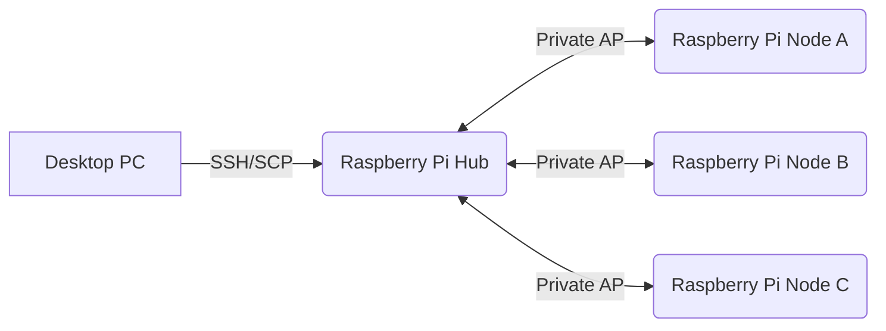

# jCommunicator

A lightweight .NET library for communicating with Raspberry Pi clusters over SSH.

`jCommunicator` is a robust SSH-based cluster management utility designed to facilitate secure communication between a local host (Hub) and remote nodes within a cluster architecture. It handles connection lifecycle management, dynamic port forwarding for node isolation, file system operations (SFTP), and command execution across the Hub and Nodes.

Built upon the Renci.SshNet library, it abstracts away the complexities of SSH tunneling, providing a high-level interface for developers to interact with distributed systems as if they were local.

---

## Intended Pysical Architecture



The desktop application communicates directly with the Hub over SSH. The Hub acts as the gateway to the Nodes, allowing secure command execution and file transfers without exposing the Nodes to the external network.

---

## Features

* SSH connection management
* Execute shell commands on the Hub
* Execute commands on Nodes through the Hub
* SCP file transfers between PC and Hub
* SFTP file transfers between PC and Nodes
* Copy files between Hub and Nodes
* Remote file management

  * Check existence
  * Retrieve last modified times
  * Move/Rename files
  * Delete files
* Automatic SSH tunnel management for multiple Nodes
* Integrated logging through **mLogger**

---

## Core Features & Method Reference

### 1. Initialization & Lifecycle Management
The foundation of any cluster interaction is establishing a secure channel to the Hub and managing node connections dynamically.

| Method | Description | Key Parameters |
| :--- | :--- | :--- |
| **`Communicator(string host, string username, string password)`** | Constructor. Initializes the logger source and stores Hub credentials. | `host`, `username`, `password` |
| **`Connect()`** | Establishes an SSH session to the Hub and rebuilds all active node tunnels. Thread-safe via internal locking. | None |
| **`Disconnect()`** | Gracefully closes all SFTP sessions, stops forwarded ports, and disposes of the SSH client. | None |
| **`IsConnected`** | Property. Returns `true` if the Hub SSH session is active. | None |

### 2. Node Management
Nodes are added dynamically. The class automatically creates a local port forward (e.g., `127.0.0.1:2200`) to the specific node's SSH port, isolating node traffic.

| Method | Description | Key Parameters |
| :--- | :--- | :--- |
| **`AddNodeSFTP(string nodeHost, string nodeUsername, bool verbose = true)`** | Creates a new SFTP tunnel for a node. Returns `true` if successful or already initialized. | `nodeHost`, `nodeUsername` |
| **`RebuildNodeTunnels(bool verbose = false)`** | *Private.* Re-establishes tunnels for all known nodes, useful after Hub network changes. | None (internal) |

### 3. File System Operations
The API distinguishes between files on the **Hub** and files on specific **Nodes**.

#### Hub File Operations
Directly interact with the Hub's filesystem using standard Linux commands executed via SSH.

| Method | Description | Key Parameters |
| :--- | :--- | :--- |
| **`HubFileExists(string hubFilePath, bool verbose)`** | Checks if a file exists on the Hub. | `hubFilePath` |
| **`HubFileLastModified(string pathVariable)`** | Returns the last modified time of a Hub file (Unix epoch conversion). | `pathVariable` |
| **`GetListOfHubFiles(string directory, string fileExtension)`** | Lists files matching a pattern on the Hub (e.g., `*.log`). | `directory`, `fileExtension` |
| **`DeleteHubFile(string hubFilePath, bool verbose)`** | Removes a file from the Hub. | `hubFilePath` |
| **`MoveHubFile(string currentFilePath, string newFilePath, bool verbose)`** | Renames or moves a file on the Hub. | `currentFilePath`, `newFilePath` |

#### Node File Operations
Interact with files on specific nodes using the established SFTP tunnels.

| Method | Description | Key Parameters |
| :--- | :--- | :--- |
| **`NodeFileExists(string nodeFilePath, string host, bool verbose)`** | Checks existence of a file on a specific Node. | `nodeFilePath`, `host` |
| **`NodeFileLastModified(string nodeFilePath, string host, bool verbose)`** | Gets last modified time for a Node file. | `nodeFilePath`, `host` |
| **`GetListOfNodeFiles(string directory, string fileExtension, string host, string username)`** | Lists files on a specific Node. | `directory`, `fileExtension`, `host`, `username` |
| **`DeleteNodeFile(string nodeFilePath, string host, bool verbose)`** | Deletes a file from a specific Node. | `nodeFilePath`, `host` |
| **`MoveNodeFile(string currentFilePath, string newFilePath, string host, string username, bool verbose)`** | Moves/rename a file on a specific Node. | `currentFilePath`, `newFilePath`, `host`, `username` |

### 4. Command Execution
Execute shell commands. Hub commands run directly; Node commands are tunneled through SSH from the Hub to the Node.

| Method | Description | Key Parameters |
| :--- | :--- | :--- |
| **`ExecuteHubCommand(string command, bool verbose)`** | Runs a command on the Hub. Throws if connection fails. | `command` |
| **`ExecuteNodeCommand(string cmd, string host, string username, bool verbose)`** | Runs a command on a Node via SSH tunnel from the Hub. Escapes quotes for safety. | `cmd`, `host`, `username` |

### 5. File Transfer (SCP/SFTP)
High-level methods for copying files between PC, Hub, and Nodes.

| Method | Description | Key Parameters |
| :--- | :--- | :--- |
| **`CopyHubToNode(string hubFilePath, string nodeFilePath, string host, string username, bool verbose)`** | SCP copy from Hub to Node. | `hubFilePath`, `nodeFilePath`, `host`, `username` |
| **`CopyPCtoHub(string PCFilePath, string HubFilePath, bool verbose)`** | Uploads a local file to the Hub via SCP. | `PCFilePath`, `HubFilePath` |
| **`CopyHubToPC(string HubFilePath, string PCFilePath, bool verbose)`** | Downloads a Hub file to the local PC via SCP. | `HubFilePath`, `PCFilePath` |
| **`CopyNodeToPC(string nodeFilePath, string PCfilePath, string nodeName, bool verbose)`** | Downloads a Node file via SFTP tunnel to the local PC. | `nodeFilePath`, `PCfilePath`, `nodeName` |
| **`CopyPCtoNode(string PCfilePath, string nodeFilePath, string host, bool verbose)`** | Uploads a local file via SFTP tunnel to a Node. | `PCfilePath`, `nodeFilePath`, `host` |

### 6. Diagnostics
Utility methods for health checks.

| Method | Description | Key Parameters |
| :--- | :--- | :--- |
| **`checkSSHDevice(bool verbose)`** | Attempts to connect to the Hub and returns a structured result (Success, Exception, Time). | `verbose` |
| **`PingNode(string host, bool verbose)`** | Pings a node via the Hub. Returns `true` if reachable. | `host` |

---

## Underlying Libraries & Protocols

The Communicator relies on two primary external libraries to function:

### 1. Renci.SshNet
This is the core dependency for all network interactions.
*   **SSH Protocol**: Used for the initial connection to the Hub (`SshClient`) and for tunneling commands to Nodes (`ExecuteNodeCommand`). It handles authentication (Password based in this implementation) and encryption.
*   **SCP Protocol**: Used for file transfers between the Local PC and the Hub (`ScpClient` in `CopyPCtoHub`, `CopyHubToPC`).
*   **SFTP Protocol**: Used for file operations on Nodes. The class creates local port forwards (`ForwardedPortLocal`) to expose each Node's SSH port locally, then uses `SftpClient` to interact with the remote filesystem securely over that tunnel.

### 2. mLogger
A custom logging abstraction used throughout the codebase.
*   **Usage**: Instantiated via `Logger.Instance`.
*   **Levels**: Supports `INFO`, `WARN`, `ERROR`, and `DEBUG`.
*   **Sources**: Allows tagging logs with specific component names (e.g., "Communicator", "NodeInfo") for easier filtering in log viewers.

---

## Requirements

* .NET 8
* SSH enabled on the Hub
* SSH enabled on each Node
* Shared SSH credentials for the cluster

## Installation

Install the required NuGet packages:

```bash
dotnet add package SSH.NET
```

and reference **mLogger** in your project.

---

## Quick Start

```csharp
using var communicator = new Communicator(
    "192.168.1.50",
    "pi",
    "password");

communicator.Connect();

// Register a Node
communicator.AddNodeSFTP(
    "node1",
    "pi");

// Execute a command on the Hub
string uptime =
    communicator.ExecuteHubCommand("uptime");

// Upload a file to the Hub
communicator.CopyPCtoHub(
    @"C:\Data\config.json",
    "/home/pi/config.json");

// Copy the file from the Hub to the Node
communicator.CopyHubToNode(
    "/home/pi/config.json",
    "/home/pi/config.json",
    "node1",
    "pi");

// Execute a command on the Node
communicator.ExecuteNodeCommand(
    "sudo systemctl restart myservice",
    "node1",
    "pi");
```

---

## Current Status

This repository represents the initial standalone extraction of the communication layer from a larger Raspberry Pi cluster management application.

Future work includes:

* Improved asynchronous APIs
* Additional cancellation support
* Separation of cluster-specific functionality into higher-level libraries
* Continued API refinement

---

## License

This project is licensed under the MIT License.
